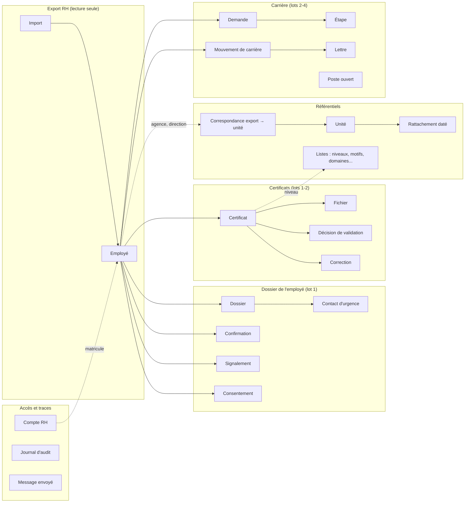

# Modèle de données — Portail carrière ACME SA

| | |
|---|---|
| **Version** | 0.5, 2026-10-07 : contrôle par les garde-fous du cours de modélisation (§A) : langage commun (§B), faits élémentaires et périmètre par lot (§C), identifiant pour chaque entité, choix de la base et source de vérité (§13). v0.4 : passe de normalisation (3NF, §11) : dossier typé et contact d'urgence en entité, rôles, anciens libellés, critères et statuts de poste en entités, trois liens explicites pour un fichier, champs déductibles retirés, dénormalisations volontaires listées. v0.3 : connexions, avis de l'employé |
| **Livrable** | 3 du lot 0 : « Modèle de données : champs obligatoires, niveaux, registre des demandes, mouvements, historique des confirmations » (message de lancement §2) |
| **Tâches** | B-04 (lot 1 : dossier, confirmations, signalements, certificats, niveaux, unités) et B-10 (demandes et mouvements de carrière) |
| **Base** | Registre des décisions v1.8 (fait foi) ; cahier des charges §8 (quelles données, d'où, qui les saisit, sensibilité) ; tableau unique des règles |
| **Niveau** | Modèle **logique** : entités, champs, liens, identifiants. Le niveau conceptuel est aux §B, §C et §2 ; le niveau physique (noms de tables, types, index, `CREATE TABLE`) relève de la conception technique (B-18) |
| **Garde-fous** | `cours_sur_modele_de _donnees.md` (même dossier) : chaque règle du cours est vérifiée au §A |

**Convention :** chaque champ cite sa source (Qx = registre, D-xx = décision, RG-xx = règle). Ce qui vient de nous est marqué **M-xx** (choix de modélisation, à valider) ; ce qui reste ouvert est marqué ❓ et repris au §8.

---

## A. Garde-fous : contrôle par le cours de modélisation

Le fichier `cours_sur_modele_de _donnees.md` sert de **garde-fou** : chaque version du modèle est vérifiée contre ses règles. État au 2026-10-07 (v0.5) :

| # | Règle du cours | État du modèle | Où |
|---|---|---|---|
| 1 | **Langage ubiquitaire** : chaque concept a une seule définition, partagée par les RH et les développeurs | ✅ Glossaire des entités et des états | §B |
| 2 | **Trois niveaux** : conceptuel (glossaire, vue d'ensemble), logique (ERD normalisé, PK et FK), physique (SQL, index) | ✅ Conceptuel et logique ici ; physique en B-18 | §B, §C, §2 à §8 ; B-18 |
| 3 | **Faits élémentaires** : partir des exigences, une à trois phrases ; les noms donnent les entités, les verbes les relations | ✅ 26 faits tirés des exigences | §C.1 |
| 4 | **Règle MVP** : une entité qu'aucune exigence *Must have* ne cite n'est pas dans le premier lot | ✅ Chaque entité est rattachée à une exigence, une priorité et un lot (Connexion et Avis : EF-607, DM-09) | §C.2 |
| 5 | **Composants de l'ERD** : entités, attributs qui ne décrivent que leur entité, relations avec cardinalités, clés | ✅ | Diagramme entités-relations |
| 6 | **Clés** : une PK unique et **immuable** par entité ; une FK par relation | ✅ Corrigé en v0.5 : toutes les entités ont un identifiant | §C.3 |
| 7 | **Cardinalités** : 1-1 par FK unique ; 1-N par FK côté « plusieurs » ; N-N par table de jointure | ✅ Dossier et Contact d'urgence (1-1) ; Rôle d'un compte, Personne ciblée, Manifestation d'intérêt (N-N) | §4, §7.2, §8.5 |
| 8 | **Les trois anomalies** (insertion, modification, suppression) évitées | ✅ Ex. : une unité existe sans employé ; un libellé ne se corrige qu'à un endroit ; supprimer un employé n'efface pas une unité | §11 |
| 9 | **3NF minimum** ; BCNF si possible | ✅ 3NF, avec dénormalisations volontaires listées ; BCNF vérifiée | §11 |
| 10 | **SQL ou NoSQL** selon la règle de décision | ✅ PostgreSQL, justifié | §13.1 |
| 11 | **Source de vérité** (*System of Record*) pour chaque donnée partagée entre modules | ✅ | §13.2 |

*Le fichier du cours s'arrête au début de sa partie 6 (« Structure d'un CREATE TABLE ») : la suite servira de garde-fou pour la conception technique (B-18).*

## B. Langage commun (glossaire des entités)

Une seule définition par mot, utilisée partout : écrans, code, tests, documents. En cas de doute, c'est celle-ci qui compte.

| Terme | Définition | Ce que ce n'est pas |
|---|---|---|
| **Employé** | Une personne présente dans l'export RH comme **active**, avec un matricule ; identifiée dans le portail par un identifiant interne (DM-01) | Pas un compte RH ; pas une personne absente de l'export |
| **Employé parti** | Un employé qui n'apparaît plus dans le dernier export : il ne peut plus se connecter, son dossier est conservé (DM-02) | Pas une suppression |
| **Dossier** | Ce que l'employé saisit lui-même : téléphone, adresse, email ou « pas d'adresse », niveau d'études déclaré ; avec le **Contact d'urgence** | Pas les données de l'export (agence, poste, date d'embauche), que l'employé confirme seulement |
| **Information du verrou** | Une des 8 informations qui débloquent le dépôt : téléphone, adresse, email, contact d'urgence, niveau d'études (à saisir) ; agence, poste, date d'embauche (à confirmer) (Q1) | — |
| **Confirmation** | Un geste daté de l'employé sur une information du verrou : saisie, modification ou confirmation sans changement | Pas une validation par les RH |
| **Profil complet** | Les 8 informations du verrou sont complètes ; débloque le dépôt de certificat (D-01) | Pas un dossier complet |
| **Dossier complet** | Profil complet **et** au moins un certificat validé (D-01) | — |
| **Certificat** | Un document déposé par l'employé (diplôme, certificat, attestation, autre), avec son niveau et ses fichiers | Pas un fichier : un certificat peut avoir plusieurs pages |
| **Certificat validé** | Un certificat dont la dernière décision est « Validé » ; seul ce statut compte pour le niveau d'études et l'éligibilité (Q5 §4) | Pas un certificat « en vérification » |
| **Niveau d'études validé** | Le rang le plus élevé parmi les certificats validés de l'employé, hors niveaux sans rang (Q3) | Pas le niveau déclaré |
| **Signalement** | La contestation d'une information que l'employé ne peut pas modifier, ou l'échec d'un contrôle automatique (Q1, D-02) | Pas une modification de l'export |
| **Compte RH** | L'accès d'une personne à l'espace RH, avec un ou plusieurs rôles, rattaché à son matricule (DM-03, DM-04) | Pas le compte employé de la même personne |
| **Unité** | Une agence, une région, une direction, un service ou le siège du référentiel officiel, avec un code qui ne change jamais (Q4 §3) | Pas une valeur brute de l'export |
| **Correspondance** | Le lien entre une valeur trouvée dans l'export et une unité officielle ; sans unité, la valeur est « À rattacher » (Q4) | — |
| **Unité à confirmer** | L'état d'un employé dont la valeur d'agence ou de direction n'a pas encore de correspondance (RG-17) | Pas une erreur de l'employé |
| **Demande** | Une demande de promotion ou de mobilité, reçue par lettre ou par le portail, suivie en 7 étapes (Q6) | Pas un signalement |
| **Lettre** | Une lettre de promotion, de transfert ou de nomination envoyée par l'institution à l'employé (Q5 §6) | Pas la lettre de demande de l'employé (celle-ci est un fichier de la Demande) |
| **Mouvement de carrière** | Un changement de poste, d'unité ou de grade à une **date d'effet**, validé par un Agent RH (Q5 §6) | Pas une demande |
| **Instantané** | Une valeur recopiée exprès pour figer ce qui était vrai à un moment donné (§11.3) | Pas une redondance |

## C. Des exigences aux entités

### C.1 Faits élémentaires

Méthode du cours : pour chaque exigence, une phrase simple. Les **noms** donnent les entités, les **verbes** les relations.

| # | Fait | Exigence | Entités | Relation |
|---|---|---|---|---|
| F-01 | L'**import** charge les **employés** actifs de l'**export** | EF-201 ; Q4 | Import, Employé | charge |
| F-02 | Un **employé** se connecte avec son nom, son prénom, sa date de naissance et un mot de passe | EF-101, EF-102 | Employé, Compte employé, Connexion | se connecte |
| F-03 | Un **employé** saisit son téléphone, son adresse, son email et son **niveau d'études** | EF-202 | Dossier, Niveau | saisit |
| F-04 | Un **employé** désigne un **contact d'urgence** avec un **lien** | EF-202 | Contact d'urgence, Lien | désigne |
| F-05 | Un **employé** confirme son agence, son poste et sa date d'embauche | EF-203 | Confirmation | confirme |
| F-06 | Chaque **confirmation** garde sa date | EF-209 | Confirmation | — |
| F-07 | Un **employé** signale une erreur sur une **information** | EF-204, EF-205 | Signalement | signale |
| F-08 | Un **employé** donne ou retire un **consentement** | EF-208, EF-702 | Consentement | donne |
| F-09 | Un **employé** au profil complet dépose un **certificat** d'un **niveau**, d'un **type** et d'un **domaine** | EF-207, EF-301, EF-302 | Certificat, Niveau, Type, Domaine | dépose, classe |
| F-10 | Un **certificat** a un ou plusieurs **fichiers** | EF-301, EF-308 | Fichier | a |
| F-11 | Un **certificat** remplace un autre certificat, qui reste archivé | EF-305 | Certificat | remplace |
| F-12 | Un **Agent RH** prend en charge un **certificat** | EF-401 | Compte RH, Certificat | prend en charge |
| F-13 | Un **Agent RH** valide ou rejette un **certificat** avec un **motif** | EF-403 | Décision, Motif de rejet | décide |
| F-14 | Un **Agent RH** corrige le niveau ou l'intitulé d'un **certificat** | EF-404 | Correction | corrige |
| F-15 | Un **Administrateur** réaffecte un **certificat** à un autre Agent RH | EF-406 | Réaffectation | réaffecte |
| F-16 | Un **Agent RH** traite un **signalement** | EF-408 | Signalement, Compte RH | décide |
| F-17 | Une **valeur de l'export** correspond à une **unité** | EF-502 | Correspondance, Unité | traduit |
| F-18 | Une **agence** est rattachée à une **région** à partir d'une date | EF-503 | Rattachement | est rattachée |
| F-19 | Une **unité** a porté d'**anciens libellés** | EF-501 | Ancien libellé | a porté |
| F-20 | Un **Administrateur** crée un **compte RH** avec des **rôles** | EF-103, EF-105 | Compte RH, Rôle d'un compte | crée, a |
| F-21 | Un **compte RH** est rattaché au matricule d'un **employé** | EF-405 | Compte RH, Employé | est rattaché |
| F-22 | Le portail envoie un **message** à un **employé** à partir d'un **modèle** | EF-703 | Message, Modèle de message | reçoit |
| F-23 | Chaque consultation et décision RH est inscrite au **journal d'audit** | EF-605 | Journal d'audit | laisse une trace |
| F-24 | Un **Agent RH** enregistre une **demande** reçue par lettre, avec son **fichier** | EF-901, EF-903 | Demande, Fichier | enregistre |
| F-25 | Une **demande** franchit des **étapes** | EF-902 | Étape | franchit |
| F-26 | Une **lettre** propose un **mouvement de carrière**, qu'un Agent RH valide | EF-906, EF-907 | Lettre, Mouvement | propose, valide |

### C.2 Périmètre par lot (règle MVP)

Une entité n'entre dans un lot que si une exigence *Must have* de ce lot la cite. Priorités : cahier des charges §6.

| Entité | Exigences | Priorité | Lot |
|---|---|---|---|
| Import, Employé, Compte employé | EF-101, EF-102, EF-201 | Must | 1 |
| Dossier, Contact d'urgence, Confirmation | EF-202, EF-203, EF-206, EF-209 | Must | 1 |
| Signalement | EF-204 (lot 1) ; EF-408 (traitement, lot 2) | Must | 1 |
| Consentement | EF-208, EF-702 | Must | 1 |
| Certificat, Fichier, Niveau, Type de document, Domaine | EF-301, EF-302, EF-303, EF-308 | Must | 1 |
| Lien du contact d'urgence | EF-202 (D-06) | Must | 1 |
| Unité, Ancien libellé, Rattachement, Correspondance | EF-501 → EF-504 | Must | 1 |
| Modèle de message, Message | EF-703 | Must | 1 |
| Décision, Motif de rejet, Correction | EF-403, EF-404, EF-407 | Must | 2 |
| Réaffectation | EF-406 | Should ⚖ | 2 |
| Compte RH, Rôle d'un compte | EF-103, EF-105 | Must | 2 |
| Journal d'audit | EF-605 | Must | 2 |
| Demande, Étape | EF-901, EF-902, EF-903 | Must | 2 |
| Lettre, Mouvement de carrière | EF-906 (Should ⚖, lot 2) ; EF-907 (Must, lot 4) | Should puis Must | 2 → 4 |
| Poste ouvert, Critère, Statut d'un poste, Personne ciblée, Manifestation d'intérêt | EF-803 → EF-807 | Must (EF-807 Should) | 4 |
| **Connexion** | EF-607 (critère de réussite n°3) | Must ⚖ | 1 |
| **Avis de l'employé** | EF-607 (critère « plaisir ») | Should ⚖ | 1 |

Les entités du lot 2 peuvent être créées dès le lot 1 si elles sont vides : la règle MVP porte sur ce qui est **construit et utilisé**, pas seulement sur ce qui existe. Le modèle complet est dessiné au lot 0 pour éviter de le casser plus tard.

### C.3 Identifiants

Le cours demande une clé primaire **unique et immuable** pour chaque entité. Règle retenue :

| Cas | Identifiant | Pourquoi |
|---|---|---|
| Toutes les entités | Un identifiant interne, attribué par le portail, qui ne change jamais | Immuable, sans signification métier |
| Exceptions : Niveau, Type de document, Domaine, Lien, Motif de rejet, Modèle de message | Leur **code** | Codes stables par définition (Q3 §4) |
| Unité | Son **code** | Q4 §3 : « il ne change jamais, même si le nom change » |
| Correspondance | Colonne de l'export + valeur trouvée | C'est ce couple qui est unique |
| Dossier, Contact d'urgence, Compte employé | L'employé (relation 1-1) | Un seul par employé |
| Rôle d'un compte | Compte + rôle | Table de jointure |

**Clés candidates à garder uniques** (BCNF) : le matricule parmi les employés actifs ; l'empreinte d'un fichier importé ; le nom de stockage d'un fichier ; le libellé officiel d'une unité active.

---

## 1. Sept principes

| # | Principe | Pourquoi | Source |
|---|---|---|---|
| 1 | **L'export RH est rangé à part**, tel qu'il est lu, et n'est jamais modifié. Ce que l'employé saisit ou confirme est rangé ailleurs. | On sait toujours ce qui vient du système RH et ce qui vient du portail. Un nouvel export n'écrase jamais une saisie de l'employé. | Q4 §6 |
| 2 | **On n'efface rien** : un certificat remplacé, une demande, une décision, une confirmation restent dans l'historique. | Le directeur l'exige pour les certificats validés et les demandes ; l'audit en a besoin. | Q2 §2, Q6 §5 |
| 3 | **Chaque information a un historique de confirmations datées** : qui l'a confirmée ou modifiée, et quand. | C'est l'« historique des confirmations » demandé, et la base de la péremption à 12 mois. | Message de lancement §2.3 ; Q10 |
| 4 | **Les listes sont des tables, pas du code** : niveaux et rangs, types de document, motifs de rejet, domaines, liens du contact d'urgence. | Elles devront être modifiables sans toucher au code (lot 4). | Q3 §4 ; EF-606 |
| 5 | **Aucun salaire, aucune colonne exclue** de l'export, nulle part dans le modèle. | Interdit du directeur. | Message de lancement §5 ; P-11 |
| 6 | **Ce qui se calcule ne se stocke pas** : pourcentage du dossier, profil complet, date de dernière confirmation, niveau d'études validé, ancienneté, retard. Les rares exceptions sont décidées et listées (§11.3). | Une valeur calculée à la demande ne peut pas être fausse ou périmée ; c'est aussi la 3e forme normale. | M-01 |
| 7 | **Toute consultation et toute décision des RH** laissent une trace dans un journal qu'on ne peut que compléter. | Exigence d'audit. | Q2 §1 ; EF-605 |

---

## 2. Vue d'ensemble

---

## 3. Employé et import (lot 1)

### 3.1 Import

Une ligne par chargement de l'export.

| Champ | Contenu | Source |
|---|---|---|
| Identifiant | Interne | — |
| Date du chargement, date de l'export | Quand, et de quand date le fichier | M-02 |
| Empreinte du fichier | Pour reconnaître un fichier déjà chargé | M-02 |
| Nombre de lignes lues, d'actifs, de valeurs « À rattacher » | Contrôle de qualité (B-01) | §8.8 |
| Chargé par | Compte RH | Q2 |

### 3.2 Employé

Ce que l'export dit de l'employé, **dans la liste blanche de colonnes** (P-11), employés actifs seulement. Rechargé à chaque import ; jamais modifié dans le portail.

| Champ | Contenu | Source |
|---|---|---|
| Identifiant | Interne, stable : ne dépend pas du matricule (voir DM-01) | M-03 |
| Matricule | Celui du système RH | Q8 §4 |
| Nom | Identification et connexion | Q8 §4 ; Q1 |
| Prénom | Identification et connexion | Q8 §4 ; Q1 |
| Date de naissance | Identification et connexion | Q8 §4 |
| Sexe | Affichage | Cahier §8.1 |
| Grade | Affichage ; éligibilité (lot 4) | Q5 §3 |
| Nature du contrat | Affichage | Cahier §8.1 |
| Valeur « agence » et valeur « direction » de l'export | **Telles quelles** ; le libellé officiel vient de la correspondance (§6.5) | Q4 §1 |
| Poste | À confirmer par l'employé, jamais modifié | Q1 |
| Date d'embauche | À confirmer par l'employé, jamais modifiée | Q1 |
| Téléphone, email, adresse **de l'export** | Valeurs de départ, proposées à l'employé ; ce qu'il saisit va dans le Dossier (§4.1) | Q1 |
| Statut dans le portail | Actif ; **Parti** s'il disparaît d'un nouvel export (D-31). État courant gardé volontairement (§11.3) | M-04 |
| Dernier import où il apparaît | Lien vers l'import | M-02 |

**Jamais présents :** colonnes bancaires, prêts et dettes, licenciement et préavis, pièce d'identité, références, épargne retraite, salaires (P-11).

### 3.3 Compte employé

Repris du portail actuel (`employee_account`).

| Champ | Contenu | Source |
|---|---|---|
| Employé | Lien | — |
| Mot de passe | Empreinte seulement (Argon2) | Q8 §4 |
| Tentatives échouées, bloqué jusqu'à | 5 essais puis 15 minutes | D-30 ; RG-80 |
| Accès réinitialisé le, par | Par un Administrateur | Q2 §1 |

### 3.4 Connexion

Une ligne par connexion réussie d'un employé. Sans elle, on ne peut pas mesurer le critère de réussite n°3 : « les employés ouvrent l'application d'eux-mêmes ».

| Champ | Contenu | Source |
|---|---|---|
| Employé, date et heure | — | Cahier §2.3, critère 3 ; M-10 |

*« Sans relance »* se calcule : une connexion qui ne suit aucun message envoyé dans les jours précédents (§7.5).

---

## 4. Dossier de l'employé (lot 1)

### 4.1 Dossier

**Une ligne par employé** : ce que l'employé saisit lui-même. Chaque champ a son type ; le niveau déclaré pointe vers la liste des niveaux.

| Champ | Contenu | Source |
|---|---|---|
| Employé | Lien (un dossier par employé) | — |
| Téléphone | Format D-05 | Q1 ; D-05 |
| Adresse | 5 à 200 caractères | Q1 ; D-05 |
| Email | Vide si « pas d'adresse » | Q1 |
| Pas d'adresse email | Oui ou non : rend l'email complet | Q1 ; RG-02 |
| Niveau d'études déclaré | Lien vers la liste des niveaux | Q1 ; Q3 §1 |

Agence, poste et date d'embauche ne sont **pas** recopiés dans le Dossier : ils restent dans Employé (l'export) ; l'employé les **confirme** seulement (§4.3).

### 4.2 Contact d'urgence

Une ligne par employé, à part du Dossier parce que c'est une personne à elle seule (trois valeurs). 🔴 Donnée sur un tiers (§8.2).

| Champ | Contenu | Source |
|---|---|---|
| Employé | Lien | — |
| Nom | — | Q1 |
| Lien avec l'employé | Lien vers la liste (Conjoint·e, Parent…) | D-06 |
| Téléphone | Format D-05 | Q1 |

### 4.3 Confirmation (historique des confirmations)

Une ligne **à chaque fois** que l'employé saisit, modifie ou confirme l'une des 8 informations du verrou. C'est l'historique demandé par le directeur ; on ne le réécrit jamais.

| Champ | Contenu | Source |
|---|---|---|
| Employé | Lien | — |
| Information | Une des 8 : téléphone, adresse, email, contact d'urgence, niveau d'études ; agence, poste, date d'embauche | Q1 ; RG-05 |
| Geste | Saisie, modification, confirmation sans changement | M-05 |
| Ancienne valeur, nouvelle valeur | Instantané du moment (§11.3) | Q1 |
| Date et heure | — | Q10 |
| Auteur | L'employé, ou un compte RH après un signalement | Q10 |

**Ce qui est calculé, pas stocké** (principe 6) :
- *date de dernière confirmation* d'une information : la plus récente de ses confirmations (Q10) ;
- *information complète* : remplie dans le Dossier ou le Contact d'urgence ; pour agence, poste, date d'embauche : au moins une confirmation (Q1) ;
- *pourcentage* « Votre dossier est complet à X % » : informations complètes sur 8 (D-03) ;
- *profil complet* : les 8 sont complètes ; il débloque le dépôt (D-01) ;
- *périmée* (lot 4) : dernière confirmation de plus de 12 mois (Q10) ;
- *profil complété en moins de 10 minutes* : écart entre la première et la dernière saisie (cahier §2.3).

### 4.4 Signalement d'erreur

| Champ | Contenu | Source |
|---|---|---|
| Employé | Lien | Q1 |
| Information | Agence, poste ou date d'embauche ; ou contrôle automatique (embauche avant 18 ans, agence inconnue) | Q1 ; D-02 |
| Origine | Signalé par l'employé, ou contrôle automatique | D-02 ; RG-16 |
| Valeur actuelle | Instantané au moment du signalement (§11.3) | Q1 |
| Valeur indiquée, précision de l'employé | — | Q1 |
| Date | — | Q1 |
| Statut | Nouveau ; En cours ; Corrigé — en attente du système RH ; Clos — valeur exacte | Maquette A8 ; D-20 |
| Décidé par, le, commentaire | Compte RH ; lot 2 | Q1 |

### 4.5 Avis de l'employé

La « question en un clic après le dépôt » qui mesure le plaisir d'utiliser l'application.

| Champ | Contenu | Source |
|---|---|---|
| Employé | Lien | — |
| Certificat | Le dépôt qui a déclenché la question | Cahier §2.3, critère « plaisir » ; M-11 |
| Réponse | Une note simple, en un clic | Cahier §2.3 |
| Date | — | — |

### 4.6 Consentement

| Champ | Contenu | Source |
|---|---|---|
| Employé | — | — |
| Objet | Mention d'information lue ; WhatsApp ; email personnel | Q1 ; Q7 §1, §2 |
| Donné ou retiré, date | Un retrait ajoute une ligne : on garde l'historique | D-09 ; M-06 |
| Version du texte | Pour savoir à quel texte l'employé a dit oui | M-06 |

---

## 5. Certificats (lots 1 et 2)

### 5.1 Certificat

| Champ | Contenu | Source |
|---|---|---|
| Identifiant, employé | — | — |
| Type | Lien vers la liste des types | Q3 §1 |
| Niveau | Lien vers la liste des niveaux ; valeur **actuelle** (celle de l'employé, ou corrigée par les RH : l'origine est dans Correction) | Q3 §2 ; D-13 |
| Intitulé | Valeur actuelle | Q3 §3 |
| Établissement | Valeur actuelle | Q3 §3 |
| Année | Valeur actuelle | Q3 §3 |
| Domaine | Lien vers la liste ; obligatoire à partir de Bac + 2 | D-04 |
| Pays | Si diplôme étranger | Q3 §4 |
| Statut | Reçu / En vérification ; Validé ; À corriger. État courant gardé volontairement (§11.3) | Q2 §2 |
| Déposé le | — | Q2 §3 |
| Pris en charge par, le | Compte RH ; vide si personne ne l'a pris. État courant gardé volontairement (§11.3) | D-12 ; RG-43 |
| Remplace | Lien vers le certificat qu'il remplace : l'ancien reste archivé | Q2 §2 ; M-07 |

**Calculé, pas stocké :** *en retard* (plus de 5 jours ouvrables depuis le dépôt, RG-40) ; *niveau d'études validé* de l'employé = le rang le plus élevé de ses certificats validés, hors des deux niveaux « hors échelle » (Q3 §1, §2) ; *dossier complet* = profil complet et au moins un certificat validé (D-01).

### 5.2 Fichier

Un certificat peut avoir plusieurs fichiers (plusieurs pages). Un fichier appartient à **un certificat, une demande (lettre jointe) ou une lettre de carrière**. Il est dans le stockage S3 ; la base ne garde que sa description.

| Champ | Contenu | Source |
|---|---|---|
| Certificat | Lien, ou vide | M-12 |
| Demande | Lien, ou vide | M-12 |
| Lettre | Lien, ou vide | M-12 |
| Nom d'origine | — | EF-308 |
| Nom de stockage | Aléatoire, unique | EF-308 |
| Type, taille | PDF, JPG, PNG ; 5 Mo | D-07 |
| Antivirus : résultat, date | — | Q8 §3 |

**Contrainte :** exactement un des trois liens est rempli. Trois liens explicites, plutôt qu'un « appartient à » générique, permettent à la base de garantir que le fichier pointe vers quelque chose qui existe.

### 5.3 Décision de validation

| Champ | Contenu | Source |
|---|---|---|
| Certificat | Lien | — |
| Décision | Validé ou À corriger | Q2 §2 |
| Motif | Un des 10 (liste) ; commentaire obligatoire pour « Autre » | Q2 §4 ; RG-46 |
| Commentaire pour l'employé | — | Q2 §4 |
| Valideur, date et heure | Jamais l'employé lui-même (séparation des tâches) | Q2 §1 ; RG-42 |

### 5.4 Correction d'un certificat

Une ligne par champ corrigé par le valideur.

| Champ | Contenu | Source |
|---|---|---|
| Certificat, champ | Niveau, intitulé, établissement, année, domaine | D-13 ; RG-44 |
| Valeur d'origine, nouvelle valeur | — | D-13 |
| Compte RH, date et heure | — | D-13 |

### 5.5 Réaffectation

| Champ | Contenu | Source |
|---|---|---|
| Certificat ; de, vers | Comptes RH | D-14 |
| Administrateur, date | — | Q2 §1 |

---

## 6. Référentiels (lot 1)

### 6.1 Listes de référence

Une table par liste, avec un code stable, un libellé, un ordre, actif ou non.

| Liste | Particularité | Source |
|---|---|---|
| **Niveaux** | Rang numérique interne (1 à 8) ; « Certification professionnelle » et « Formation continue / Attestation » **sans rang** (hors échelle) ; exemples pour l'infobulle | Q3 §2 ; D-11 |
| Types de document | Diplôme, Certificat, Attestation, Autre | Q3 §1 |
| Motifs de rejet | 10 motifs, avec le message poli affiché à l'employé ; « Autre » exige un commentaire | Q2 §4 ; RG-46 |
| Domaines | Liste fermée avec « Autre » | D-04 ; P-01 |
| Liens du contact d'urgence | Conjoint·e, Parent, Enfant, Frère / Sœur, Autre | D-06 |

Les niveaux seront alignés sur la grille de classification de la DRH quand elle sera reçue (Q3 §5) : c'est pourquoi le rang est une donnée, et non un ordre écrit dans le code.

### 6.2 Unité

| Champ | Contenu | Source |
|---|---|---|
| Code | Stable et unique : ne change jamais, même si le nom change | Q4 §3 |
| Libellé officiel | Avec les accents | Q4 §3 |
| Type | Agence, Région, Direction, Service rattaché, Siège | Q4 §3 |
| Date de début, date de fin | *Actif* se calcule : aujourd'hui entre les deux dates | Q4 §3 |
| Responsable (DA, DR) | Lien vers un employé ; ❓ D-26 | P-10 |

### 6.3 Ancien libellé

Une ligne par ancien nom d'une unité (une unité peut en avoir plusieurs).

| Champ | Contenu | Source |
|---|---|---|
| Unité, libellé | Pour reconnaître les valeurs de l'export | Q4 §3 |

### 6.4 Rattachement daté

Une agence appartient à **une seule région à la fois** ; un service du siège à une direction. Le rattachement change avec le temps, donc il est daté.

| Champ | Contenu | Source |
|---|---|---|
| Unité, unité de rattachement | Agence → Région ; Service → Direction | Q4 §3 |
| Date de début, date de fin | Vide = en cours | Q4 §3, §4 |
| Importé le, par, fichier d'origine | Le fichier agence → région de la DRH | Q4 §4 |

### 6.5 Correspondance export → unité

| Champ | Contenu | Source |
|---|---|---|
| Colonne de l'export, valeur trouvée | Exemple : agence « PB » | Q4 §1, §4 |
| Unité officielle | **Vide = « À rattacher »** : l'employé est « Unité à confirmer » | Q4 §5 ; RG-17 |
| Première apparition | Lien vers l'import | Q4 §4 |
| Validée par, le | La responsable du référentiel | Q4 §4 |

*Nombre d'employés concernés* : calculé (employés actifs dont la valeur d'export est celle-ci).

---

## 7. Accès et traces (lots 1 et 2)

### 7.1 Compte RH

Évolution de `admin_account` du portail actuel.

| Champ | Contenu | Source |
|---|---|---|
| Nom | — | Q2 |
| Email | — | Q2 |
| Matricule rattaché | Lien vers l'employé : sert à ne jamais lui proposer ses propres certificats ni ses signalements | Q2 §1 ; S-05 |
| Double authentification | Identifiant chez Cognito ; activée ou non | Q8 §4 |
| Statut, dernière connexion, créé par, le | — | EF-105 |

### 7.2 Rôle d'un compte

Une ligne par rôle : un compte peut en avoir plusieurs (DM-03).

| Champ | Contenu | Source |
|---|---|---|
| Compte RH | Lien | DM-03 |
| Rôle | Administrateur, Agent RH, Responsable du référentiel, Lecture seule | Q2 ; Q4 §2 |

### 7.3 Journal d'audit

On n'y ajoute que des lignes ; personne ne peut en modifier ou en supprimer.

| Champ | Contenu | Source |
|---|---|---|
| Date et heure | — | Q2 §1 |
| Qui | Compte RH ; les gestes de l'employé sur son dossier restent dans les confirmations (DM-06) | Q2 §1 |
| Avec quel rôle | Instantané : le rôle exercé à ce moment-là (§11.3) | Q2 §1 |
| Action | Consultation d'un dossier, consultation d'un document, validation, rejet, réaffectation, export, modification du référentiel, gestion des comptes | Maquette A11 ; EF-605 |
| Objet | Employé, certificat, unité, compte… | EF-605 |
| Détail | Ancienne et nouvelle valeur, filtre d'un export, motif | EF-605 |

### 7.4 Modèle de message

| Champ | Contenu | Source |
|---|---|---|
| Code, canal | WhatsApp, email institutionnel, email personnel | Q7 §1 |
| Texte, approuvé | Modèles approuvés à l'avance | Q7 §2 |

### 7.5 Message envoyé

| Champ | Contenu | Source |
|---|---|---|
| Employé | Lien | Q7 §1 |
| Modèle | Lien ; le **canal** vient du modèle | Q7 §2 |
| Raison | Changement de statut, relance, lancement, résumé des postes | Q7 §3 |
| Envoyé le, résultat | Livré, échoué | Cahier §8.2 |

Le nombre de relances (3 au plus, D-34) et l'arrêt dès que le dossier est complet se vérifient à partir de cette table.

---

## 8. Demandes et mouvements de carrière (lots 2 à 4, B-10)

### 8.1 Demande

| Champ | Contenu | Source |
|---|---|---|
| Employé | — | Q6 §4 |
| Date de réception, canal | Lettre ou portail | Q6 §2, §4 |
| Type | Promotion ou changement de poste (mobilité) | Q6 |
| Poste visé | Lien vers un poste ouvert ; vide si le poste n'est pas publié ou si la demande est spontanée | Q6 §5 |
| Poste visé (texte) | Pour un poste non publié | Q6 §4 |
| Motivation | — | Q6 §4 |
| Étape en cours, clôture | Une des 7 étapes ; clôture : acceptée, refusée, reportée, retirée. État courant gardé volontairement (§11.3). La **décision** de la DRH est le résultat de l'étape 5 (§8.2) | Q6 §3, §4 |
| Profil au moment de la demande | **Copie figée** (instantané, §11.3), faite à la réception : niveau validé, poste, unité, grade, ancienneté (DM-05) | Q6 §4 |
| Responsable du traitement | Compte RH | Q6 §4 |
| Accusé de réception envoyé le | 2 jours ouvrables (D-37) | Q6 §5 |
| Origine | Saisie, ou importée de l'historique Excel (B-11) | M-08 |

La lettre jointe est un Fichier lié à la demande (§5.2). Aucune demande n'est supprimée (Q6 §5).

### 8.2 Étape d'une demande

Une ligne par étape franchie, pour garder tout le parcours.

| Champ | Contenu | Source |
|---|---|---|
| Demande, numéro d'étape | 1 à 7 | Q6 §3 |
| Résultat | Selon l'étape : « Disponibilité confirmée / Pas de disponibilité » ; « Positive / Négative » ; « Approuvée / Non approuvée » ; décision | Q6 §3 |
| Date, commentaire | — | Q6 §3 |
| Saisi par | Compte RH (les autres acteurs n'ont pas d'accès au départ : D-24) | D-24 |

### 8.3 Lettre (de promotion, de transfert, de nomination)

| Champ | Contenu | Source |
|---|---|---|
| Employé | — | Q5 §6 |
| Référence de la lettre | Numéro ou emplacement dans le dossier papier | D-33 |
| Numérisée le, par | ❓ QR-07, D-38 | QR-07 |
| Statut de l'extraction | À extraire ; extraite, à contrôler ; contrôlée | Q5 §6 |

Son éventuelle copie (**masquée, sans les montants**, ou aucune : D-33) est un Fichier lié à la lettre (§5.2).

### 8.4 Mouvement de carrière

| Champ | Contenu | Source |
|---|---|---|
| Employé | Lien ; si une lettre est liée, c'est le même employé | Q5 §6 |
| Type | Promotion, transfert, nomination | Q5 §6 |
| **Date d'effet** | Sert à calculer l'ancienneté dans le poste | Q5 §6 |
| Poste avant | Instantané (§11.3) | M-09 |
| Poste après | — | M-09 |
| Unité avant, unité après | Deux liens vers le référentiel | M-09 |
| Grade avant | Instantané (§11.3) | M-09 |
| Grade après | — | M-09 |
| Lettre d'origine | Lien ; vide si saisi à la main | Q5 §6 |
| Proposé par l'extraction | Oui ou non | Q5 §6 |
| Validé par, le | Compte RH. **Rien n'est retenu sans validation humaine** | Q5 §6 |

**Jamais présent :** salaire, indemnité, montant (Q5 §6).

**Calculé, pas stocké :** ancienneté dans le poste = aujourd'hui moins la date d'effet du dernier mouvement validé, ou la date d'embauche s'il n'y en a pas (Q5 §6).

### 8.5 Poste ouvert (lot 4, esquisse)

| Entité | Champs | Source |
|---|---|---|
| **Poste ouvert** | Intitulé, code du poste, unité (lien), grade visé, mission, date d'ouverture, date limite, confidentiel, motif de confidentialité ; statut actuel (état courant, §11.3) | Q5 §1, §2, §5 |
| **Critère d'un poste** | Poste (lien), type de critère (niveau minimum, domaine, ancienneté dans l'institution, grade, ancienneté dans le poste, unité), valeur ; lien vers Niveau, Domaine ou Unité selon le type | Q5 §3 |
| **Statut d'un poste** (historique) | Poste, statut (Brouillon, Publié, Clôturé, Pourvu), date, auteur | Q5 §1 |
| **Personne ciblée** | Poste confidentiel, employé | Q5 §5 |
| **Manifestation d'intérêt** | Poste, employé, date, hors critères (instantané au moment de la manifestation) | Q5 §5 |

À détailler avant le lot 4.

---

## 9. Ce que devient le modèle actuel

Le portail actuel (`app-web-v2`) a déjà des tables. La migration vers PostgreSQL doit être **non destructive** (B-18).

| Table actuelle | Devient | Remarque |
|---|---|---|
| `employee_account`, `session` | Compte employé, sessions | Gardées |
| `admin_account` | Compte RH | + rôles multiples, matricule rattaché, double authentification |
| `document` | Certificat + Fichier | + type, niveau, intitulé, établissement, année, domaine, pays, statut |
| `employee_update`, `employee_change`, `employee_submitted_change` | Dossier, Contact d'urgence, Confirmation | Le circuit « brouillon → envoi » du MVP laisse la place à une confirmation information par information |
| `career_entry`, `career_profile` | Formations, expériences, compétences de « Ma carrière » | Lot 4, hors verrou (Q1 ; EF-802) |
| Lecture directe du CSV | Import + Employé | L'export est chargé dans la base à chaque import, au lieu d'être relu à chaque requête |

---

## 10. Décisions de modélisation à prendre

**Statut : ✅ DM-01 à DM-07 : propositions validées par le développeur le 2026-10-07.** Le directeur garde le dernier mot.

| N° | Question | Décision | Pourquoi elle compte | Statut |
|---|---|---|---|:---:|
| DM-01 | **Identifiant de l'employé** : le matricule, ou un identifiant interne ? L'export contient 2 matricules en double chez les actifs (B-01). | Identifiant interne ; le matricule reste unique parmi les actifs, et un doublon bloque l'import de la ligne concernée jusqu'à correction dans le système RH | Un compte par personne, jamais deux (cahier §8.8) | ✅ dév. |
| DM-02 | Que fait un nouvel import d'un employé **absent** ? | Statut « Parti », dossier conservé et visible des RH, plus de connexion ; actif à nouveau s'il réapparaît (D-31) | Conservation et historique | ✅ dév. |
| DM-03 | Une personne a-t-elle **un compte RH avec plusieurs rôles**, ou un compte par rôle ? (Mme Nérius est Agent RH et responsable du référentiel) | Un compte, plusieurs rôles | Simplicité ; séparation des tâches rattachée à la personne | ✅ dév. |
| DM-04 | L'employé RH utilise-t-il le **même identifiant** pour son dossier d'employé et pour l'espace RH ? | Non : deux accès distincts (le second avec double authentification), reliés par le matricule | Q8 §4 : règles d'accès différentes | ✅ dév. |
| DM-05 | « **Profil au moment de la demande** » : instantané figé, ou reconstitué depuis l'historique ? | Copie figée (niveau validé, poste, unité, grade, ancienneté) enregistrée à la réception | La fiche montre ce que les RH et la Direction Générale avaient sous les yeux, même si le dossier change ensuite | ✅ dév. |
| DM-06 | Les gestes de l'**employé** vont-ils aussi au journal d'audit, ou seulement dans les confirmations ? | Seulement dans les confirmations ; le journal d'audit est réservé aux RH | Évite un journal énorme ; les confirmations suffisent pour l'employé | ✅ dév. |
| DM-07 | Les **valeurs saisies par l'employé** (téléphone, adresse…) retournent-elles vers le système RH ? | Non au lot 1 ; export des corrections au lot 2 avec D-20 | L'export reste en lecture seule (Q4 §6) | ✅ dév. |
| DM-09 | **Connexion** et **Avis** ne sont cités par aucune exigence (règle MVP, §C.2), mais ils mesurent deux critères de réussite du directeur. Les garder ? | Exigence **EF-607** ajoutée au cahier (§6, D6) : Connexion en **Must** au lot 1 ; Avis en **Should** au lot 1 | Sans eux, deux critères de réussite ne se mesurent pas ; avec eux sans exigence, le modèle contredirait la règle MVP | ✅ dév. |
| DM-08 | **Photo de l'employé** : l'institution en conserve pour une partie des employés, sans que tous l'aient donnée. Le portail doit-il en afficher ou en collecter ? | Aucune photo dans le modèle tant que le directeur ne l'a pas décidé (D-39) | Donnée personnelle absente du registre ; consentement ; poids des pages sur téléphone | ❓ |

---

## 11. Normalisation

Le modèle vise la **troisième forme normale (3NF)** : chaque valeur est atomique (1NF), chaque champ dépend de toute la clé (2NF) et de rien d'autre que la clé (3NF). La passe du 2026-10-07 (v0.4) a corrigé les écarts ci-dessous ; les exceptions restantes sont **volontaires** et listées.

### 11.1 Corrections faites en v0.4

| Forme | Écart en v0.3 | Correction |
|---|---|---|
| 1NF | Champs regroupés : nom et prénom, sexe-grade-contrat, intitulé-établissement, poste et grade avant / après, nom et email, type et taille | Un champ par valeur |
| 1NF | Contact d'urgence : trois valeurs dans une | Entité **Contact d'urgence** (§4.2) |
| 1NF | Critères d'un poste dans un seul champ | Entité **Critère d'un poste** (§8.5) |
| 1NF | Rôles d'un compte dans un seul champ | Entité **Rôle d'un compte** (§7.2) |
| 1NF | Anciens libellés d'une unité dans un seul champ | Entité **Ancien libellé** (§6.3) |
| Intégrité | « Information du dossier » rangeait toutes les valeurs dans un même champ texte : le niveau déclaré ne pouvait pas pointer vers la liste des niveaux | **Dossier** typé, un champ par information (§4.1) |
| Intégrité | Fichier : un « appartient à » générique | Trois liens explicites, exactement un rempli (§5.2) |
| 3NF | Unité : statut déductible des dates | Retiré : calculé |
| 3NF | Correspondance : nombre d'employés déductible | Retiré : calculé |
| 3NF | Information : date de dernière confirmation déductible des confirmations | Retirée : calculée |
| 3NF | Message : canal déductible du modèle de message | Retiré : vient du modèle (§7.4) |
| 3NF | Demande : décision = résultat de l'étape 5 | Retirée : lue dans l'étape (§8.2) |
| 3NF | Certificat : « valeurs retenues » en double des champs et des corrections | Retirées : les champs portent la valeur actuelle, l'origine est dans Correction |
| 3NF | Mouvement : l'employé se déduit de la lettre quand elle existe | Gardé (la lettre est facultative), avec la contrainte « même employé que la lettre » |

### 11.2 Ce qui reste calculé

Pourcentage du dossier, information complète, profil complet, dossier complet, date de dernière confirmation, information périmée, niveau d'études validé, écart entre niveau déclaré et validé, certificat en retard, unité active, nombre d'employés d'une correspondance, ancienneté dans l'institution et dans le poste, connexion « sans relance », délais de traitement.

### 11.3 Dénormalisations volontaires

**a) États courants**, gardés à côté de leur historique pour que la file de validation, les listes et les tableaux de bord restent simples et rapides. Règle : l'état courant est mis à jour **dans la même opération** que la ligne d'historique, jamais seul.

| Champ | Historique dont il se déduit | Pourquoi le garder |
|---|---|---|
| Certificat → statut | Décisions | Filtrer la file et les listes par statut |
| Certificat → pris en charge par | Prise en charge et réaffectations | Afficher « En cours — Agent RH » dans la file |
| Demande → étape en cours, clôture | Étapes | Filtrer les demandes par étape |
| Poste ouvert → statut actuel | Statuts d'un poste | Afficher les postes publiés |
| Employé → statut (Actif, Parti) | Imports | Refuser la connexion d'un employé parti sans recalcul |

**b) Instantanés** : des valeurs recopiées **exprès**, parce qu'elles doivent rester ce qu'elles étaient à un moment donné. Ce ne sont pas des redondances : ce sont des faits historiques. Les remplacer par un lien réécrirait l'histoire à chaque changement.

| Champ | Ce qu'il fige |
|---|---|
| Confirmation → ancienne et nouvelle valeur | La valeur au moment du geste |
| Correction → valeur d'origine | Ce que l'employé avait déclaré |
| Signalement → valeur actuelle | La valeur contestée au moment du signalement |
| Journal d'audit → rôle | Le rôle exercé au moment de l'action |
| Demande → profil au moment de la demande | Ce que les RH et la Direction Générale avaient sous les yeux (DM-05) |
| Mouvement → poste et grade avant | La situation d'avant, écrite dans la lettre |
| Manifestation d'intérêt → hors critères | L'éligibilité au moment où l'employé s'est manifesté |
| Import → nombres de lignes, d'actifs, de valeurs à rattacher | Le constat de qualité de ce chargement |

## 12. Cohérence avec les besoins

Voir la page `diagramme-entites-relations.html` : chaque critère de réussite et chaque exigence qui demande une donnée y est relié aux entités qui la portent.

## 13. Base de données et source de vérité

### 13.1 SQL ou NoSQL

Règle du cours : SQL si les relations sont claires, si la cohérence forte (ACID) est exigée et si le schéma est stable.

| Critère | Le portail | Conclusion |
|---|---|---|
| Relations | Nombreuses et fortes : employé, certificat, décision, unité, demande… | SQL |
| Cohérence | Une décision et le changement de statut du certificat doivent réussir ou échouer ensemble (§11.3) ; droits d'accès ; journal d'audit | ACID exigé |
| Schéma | Stable, défini au lot 0 | SQL |
| Volume | ~500 employés, quelques milliers de certificats | Aucun besoin de NoSQL |

**→ PostgreSQL**, ce que recommande déjà le registre (Q8 §3, base gérée RDS ; choix à confirmer par la DIT). Les fichiers restent hors de la base, dans S3 (Q8 §3).

### 13.2 Source de vérité de chaque donnée

| Donnée | Source de vérité | Ce que fait le portail |
|---|---|---|
| Identité, matricule, poste, date d'embauche, grade, contrat, valeurs d'agence et de direction | **Système RH** (export) | Les lit sans jamais les modifier (Q4 §6) |
| Coordonnées, contact d'urgence, niveau déclaré, confirmations | **Portail** (saisie de l'employé) | Les tient ; les renvoie au système RH au lot 2 (DM-07, D-20) |
| Certificats, décisions, corrections | **Portail** | Les tient |
| Unités, rattachements, correspondances | **Référentiel**, sous la responsabilité de la responsable du référentiel (Q4 §2) | Les tient pour elle ; l'affichage n'utilise que les libellés officiels |
| Niveaux, motifs, domaines, liens | **Tableau unique des règles**, puis le portail au lot 4 (Q3 §4) | Les tient comme données |
| Demandes | **Portail** (registre des demandes, Q6) | Les tient ; l'historique importé de l'Excel y entre une fois (B-11) |
| Mouvements de carrière | **Portail** jusqu'à l'étape B ; ensuite export vers le système RH (Q5 §6) | Les tient, puis les exporte |
| Comptes RH, double authentification | **Portail** pour les rôles ; **Cognito** pour la double authentification (Q8 §4) | — |

## 14. Suite

1. ✅ DM-01 à DM-07 tranchés le 2026-10-07 ; DM-08 (photo) posé au directeur (D-39).
2. ✅ Diagramme entités-relations publié ; normalisation 3NF faite (v0.4).
3. B-10 : détailler les étapes des demandes et le modèle « mouvement de carrière » avec l'échantillon de lettres ; B-11 : colonnes du fichier Excel d'import de l'historique des demandes.
4. B-18 : noms de tables, types, index et migration non destructive vers PostgreSQL.
